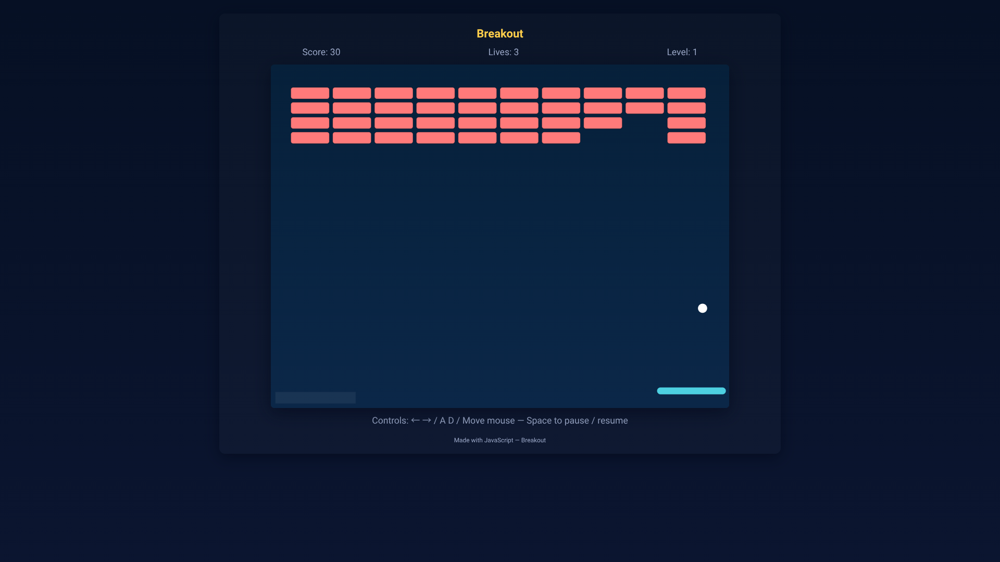

# Breakout (Block Breaker)

A simple browser breakout game built with HTML/CSS/JavaScript (Canvas).

## How to run
Download
or

1. Put the following files in the same folder:
   - index.html
   - style.css
   - script.js
   - bgm.mp3  ← add your background music file named `bgm.mp3` here
2. Open `index.html` in your browser.

## Controls
- Left / Right arrows or A / D to move the paddle
- Move the mouse (or touch / pointer) to control the paddle directly
- Space to start / pause / resume
- Start / Restart button available on the overlay

## BGM behavior / autoplay policy
- The game will attempt to play `bgm.mp3` in a loop while the game is running.
- Due to browser autoplay restrictions, the BGM starts only after a user interaction (clicking the Start button or pressing Space to start/resume).
- BGM is paused when the game is paused, on level screens, or on game over. It resumes when gameplay resumes.

## Features
- Levels: clear all bricks to advance
- Score and lives display
- Responsive and supports high DPI (devicePixelRatio)
- Works with keyboard, mouse, and touch/pointer devices

## Possible improvements
- Add sound effects (hit / break / life lost) with Web Audio API
- Provide a volume slider or mute button in the UI
- Better audio loading/error handling
